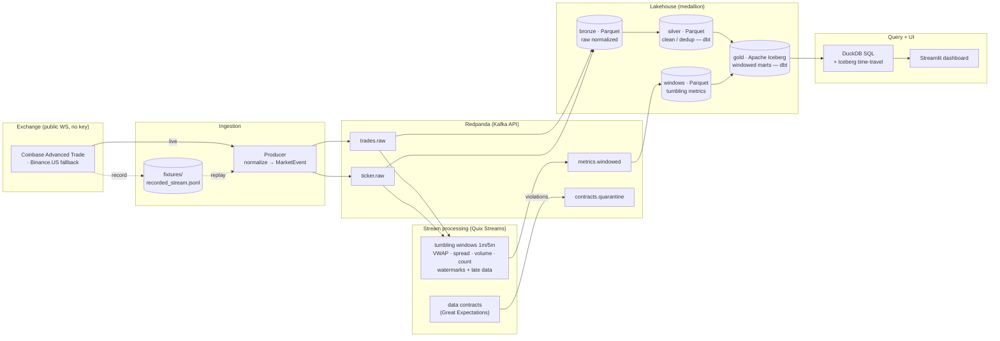

# TickStream

**A real-time streaming lakehouse for crypto market microstructure — runs end-to-end on your laptop with one command, no API keys, no cloud.**

TickStream ingests a live crypto market-data WebSocket, computes rolling microstructure
analytics with windowed stream processing, enforces data contracts (quarantining bad
records), and lands query-ready lakehouse tables — Redpanda → Quix Streams → bronze/silver
Parquet → gold Apache Iceberg → DuckDB / Streamlit.

> **Status:** under active construction. **Phases 1–3 are complete** — see
> [Build phases](#build-phases). A recorded-fixture **replay harness** makes the whole
> pipeline reproducible offline with no network: `make replay` feeds a committed sample of
> real Coinbase market data through Redpanda → bronze Parquet (raw tee) **and** **Quix Streams
> tumbling-window analytics** → a windows Parquet dataset, deterministically.

---

## Architecture



**Medallion layers:** _bronze_ = raw normalized events (Parquet) · _silver_ = cleaned,
typed, deduplicated (dbt model) · _gold_ = windowed microstructure marts as Iceberg tables
(schema evolution + time travel).

---

## Why this stack (tradeoffs)

| Choice | Over | Why |
| --- | --- | --- |
| **Redpanda** | Kafka, Kinesis | Single container, no JVM/Zookeeper, Kafka-API compatible — real streaming that runs on a laptop. |
| **Quix Streams** | Flink, Faust | Python-native Pandas-like `StreamingDataFrame`, native Redpanda pairing; Faust is unmaintained. |
| **Apache Iceberg** | plain Parquet | Schema evolution, snapshots/time-travel, compaction for the gold marts. |
| **DuckDB + dbt** | Spark | Embedded SQL engine + SQL marts; zero infra, fast analytics over the lake. |

_(Expanded in the Phase 6 README.)_

---

## Quick start

```bash
make up             # start Redpanda (+ Console at http://localhost:8080), wait until healthy
make test           # run the full test suite against the live broker
make replay         # OFFLINE: replay fixture -> Quix windows -> bronze + windows Parquet
make process        # run the live Quix Streams windowed processor
make demo           # host round-trip: publish hand-crafted events and read them back (exact)
make down           # stop the stack
```

### Record & replay harness

The pipeline is developed and tested against a **committed fixture of real Coinbase data**, so
tests and demos never depend on a live socket:

```bash
make replay   # offline: normalize fixtures/recorded_stream.jsonl -> Redpanda (no network/keys)
make record   # online: capture a fresh ~60s live sample to the fixture (the only socket use)
make produce  # online: stream live exchange data into Redpanda continuously (Ctrl-C to stop)
```

`record` is the *only* component that touches the exchange WebSocket; everything downstream
runs off the fixture. Normalization (raw exchange JSON → the `MarketEvent` contract) is a pure,
unit-tested function shared by the live producer and the replayer, so replay exercises the exact
same code path as production. Switch exchanges (Coinbase ↔ Binance.US) in
[`config/source.yaml`](config/source.yaml).

### Stream processing (windowing)

The processor ([`processing/app.py`](src/tickstream/processing/app.py)) is a **Quix Streams**
`StreamingDataFrame` pipeline that consumes `trades.raw` / `ticker.raw` and computes **tumbling
windows** per symbol, emitting closed windows to `metrics.windowed`:

- **1-minute and 5-minute** windows, **keyed by symbol** (windowing is per message key).
- **Event-time** based: a `timestamp_extractor` reads each record's `ts_event`, so a trade is
  bucketed by *when it happened*, not when it was consumed — out-of-order data lands in the
  correct window.
- **Watermarks + late data:** a `grace_ms` period tolerates out-of-order arrivals; records later
  than the grace are routed to an `on_late` hook (logged + dropped, not silently merged).
- **Metrics:** VWAP = Σ(price·size)/Σ(size), trade volume, trade count (from trades); average
  bid/ask spread and mid (from ticker).

The windowing math has a pure, socket-free twin in
[`processing/metrics.py`](src/tickstream/processing/metrics.py) that serves as its **exact test
oracle**: the integration test replays the fixture, runs the real Quix processor, and asserts the
streamed closed windows match the reference **field-for-field**. `make replay` then lands the raw
events to **bronze Parquet** and the windows to a Parquet dataset for the lakehouse.

Requirements: Docker + `docker compose`, and [`uv`](https://github.com/astral-sh/uv).
The project pins **Python 3.11** (managed by uv). Ports used: Redpanda `19092`,
Console `8080`, dashboard `8502` (later). No ports clash with common local services.

### Useful commands

```bash
make install      # uv sync (core + dev deps)
make test-unit    # unit tests only — no broker required
make lint         # ruff check
make format       # ruff format
tickstream --help # CLI: health · topics-create · produce-demo · demo · record · replay · produce
```

---

## Data source & licensing

Public WebSocket feeds only — **Coinbase Advanced Trade** (default) with a **Binance.US**
fallback, selectable in [`config/source.yaml`](config/source.yaml). No API keys. Symbols are
throttled to `BTC-USD, ETH-USD, SOL-USD`. The raw feed is **not redistributed** — only small
sample fixtures are committed, for offline tests and replay.

---

## Build phases

| Phase | Scope | State |
| --- | --- | --- |
| 1 | Scaffold + broker: uv project, src layout, Redpanda compose (healthy), Makefile, CI, broker round-trip test | ✅ done |
| 2 | Real WebSocket producer (Coinbase + Binance.US fallback, reconnect/backoff) + `make record` / `make replay` harness | ✅ done |
| 3 | Quix Streams tumbling-window microstructure metrics (VWAP/spread/volume/count) on event time, with watermarks + late-data handling; bronze Parquet | ✅ done |
| 4 | dbt-duckdb silver/gold marts + Iceberg time-travel | ⬜ |
| 5 | Data contracts (Great Expectations) + quarantine + SLA assertions | ⬜ |
| 6 | Streamlit dashboard + polished README/diagram | ⬜ |

---

## Project layout

```
src/tickstream/
  config.py        # env + source.yaml settings (pydantic)
  logging.py       # structlog JSON logging
  schema.py        # normalized MarketEvent contract
  kafka_utils.py   # producer/consumer factories, topic admin, health
  consume.py       # read events back off Redpanda
  cli.py           # `tickstream` CLI (typer)
  producer/        # WebSocket clients, normalize, record, replay, live service
    exchanges/     #   Coinbase + Binance.US WS clients
    normalize.py   #   pure raw->MarketEvent normalization (unit-tested)
    record.py      #   capture live -> fixture   replay.py # fixture -> Redpanda
    service.py     #   live producer w/ reconnect+backoff
  processing/      # Quix Streams windowing (app.py) + pure metrics oracle (metrics.py)
  lake/            # bronze.py / windows.py Parquet sinks; (Phase 4) silver/gold + Iceberg
  pipeline.py      # `tickstream pipeline` — full offline replay -> bronze -> windows
  quality/         # (Phase 5) contracts + quarantine + SLAs
  query/ ui/       # (Phase 4/6) DuckDB queries + Streamlit dashboard
config/source.yaml # exchange / symbols / channels
docker-compose.yml # Redpanda + Console (+ later services)
Makefile           # up / down / test / demo / record / replay / lint / format
tests/             # pytest (unit + broker integration)
```

## License

MIT. Market data belongs to the respective exchanges and is not redistributed.
