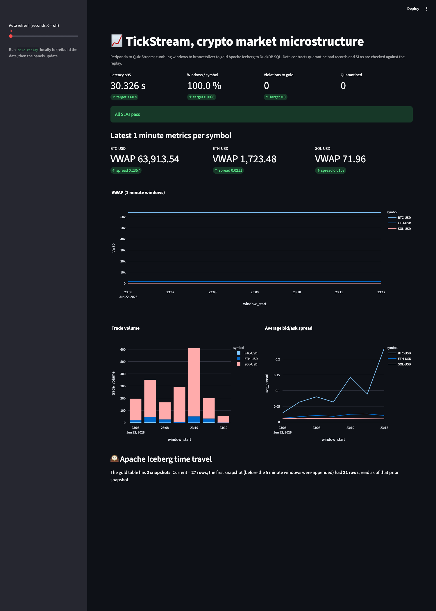
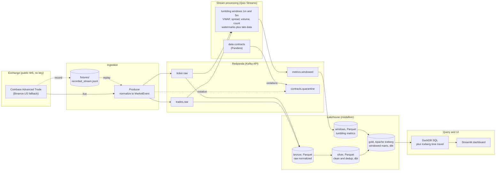

# TickStream

**A real time streaming lakehouse for crypto market microstructure. It runs end to end on a laptop with one command, no API keys, and no cloud.**

By **Linga Reddy Gudisha**.

TickStream ingests a live crypto market data feed, computes rolling microstructure analytics with windowed stream processing, enforces data quality contracts (quarantining bad records), and lands query ready lakehouse tables. The flow is Redpanda, then Quix Streams windowing, then bronze and silver Parquet, then a gold Apache Iceberg table, then DuckDB SQL and a Streamlit dashboard.

> **Status: complete (all 6 phases).** The whole pipeline is reproducible offline with no network. `make replay` feeds a committed sample of real Coinbase market data through the entire stack and proves it, deterministically. There is a live demo dashboard too (see [Dashboard](#dashboard)).



---

## Architecture



**Medallion layers.** Bronze is the raw normalized events as Parquet. Silver is cleaned, typed, and de duplicated by dbt. Gold is the windowed microstructure marts as Iceberg tables, which give me schema evolution and time travel.

---

## Why I picked this stack

| Choice | Over | Why |
| --- | --- | --- |
| **Redpanda** | Kafka, Kinesis | One container, no JVM, no Zookeeper, Kafka API compatible. Real streaming that runs on a laptop. |
| **Quix Streams** | Flink, Faust | Python native, a Pandas like StreamingDataFrame, pairs natively with Redpanda. Faust is unmaintained. |
| **Apache Iceberg** | plain Parquet | Schema evolution, snapshots and time travel, compaction, for the gold marts. |
| **DuckDB plus dbt** | Spark | An embedded SQL engine plus SQL marts. Zero infra and fast analytics over the lake. |

---

## Quick start

```bash
make up             # start Redpanda (plus a Console at http://localhost:8080), wait until healthy
make test           # run the full test suite against the live broker
make replay         # OFFLINE medallion: replay, Quix windows, bronze, dbt silver and gold, Iceberg, SLAs
make dashboard      # Streamlit dashboard at http://localhost:8502 (VWAP, spread, volume, time travel)
make query          # DuckDB SQL over the gold Iceberg table plus an Iceberg time travel query
make down           # stop the stack
```

Requirements: Docker with `docker compose`, and [`uv`](https://github.com/astral-sh/uv). The project pins **Python 3.11** (managed by uv). Ports used: Redpanda 19092, Console 8080, dashboard 8502.

### Useful commands

```bash
make install      # uv sync --all-extras (core plus all extras plus dev)
make test-unit    # unit tests only, no broker required
make lint         # ruff check
tickstream --help # CLI: health, topics-create, demo, record, replay, produce, process,
                  #      bronze, build-marts, query, contracts, pipeline  (plus make dashboard)
```

---

## Data source and licensing

Public WebSocket feeds only, with **Coinbase Advanced Trade** as the default and a **Binance.US** fallback, selectable in [`config/source.yaml`](config/source.yaml). No API keys. Symbols are throttled to `BTC-USD, ETH-USD, SOL-USD`. I do not redistribute the raw feed, only a small sample fixture for offline tests and replay.

### Record and replay harness

I develop and test the pipeline against a committed fixture of real Coinbase data, so tests and demos never depend on a live socket:

```bash
make replay   # offline: normalize fixtures/recorded_stream.jsonl to Redpanda (no network, no keys)
make record   # online: capture a fresh sample to the fixture (the only socket use)
make produce  # online: stream live exchange data into Redpanda continuously
```

`record` is the only component that touches the exchange WebSocket. Everything downstream runs off the fixture. Normalization (raw exchange JSON to the `MarketEvent` contract) is a pure, unit tested function shared by the live producer and the replayer, so replay exercises the exact same code path as production.

---

## Stream processing (windowing)

The processor ([`processing/app.py`](src/tickstream/processing/app.py)) is a **Quix Streams** `StreamingDataFrame` pipeline that consumes `trades.raw` and `ticker.raw` and computes **tumbling windows** per symbol, emitting the closed windows to `metrics.windowed`:

- **1 minute and 5 minute** windows, keyed by symbol.
- **Event time** based. A timestamp extractor reads each record's `ts_event`, so a trade is bucketed by when it happened, not when it was consumed, and out of order data lands in the correct window.
- **Watermarks and late data.** A grace period tolerates out of order arrivals, and records later than the grace go to an on_late hook (logged and dropped, never silently merged).
- **Metrics.** VWAP (the volume weighted average price), trade volume, trade count, plus average bid and ask spread and mid.

The windowing math has a pure, socket free twin in [`processing/metrics.py`](src/tickstream/processing/metrics.py) that serves as its exact test oracle. The integration test replays the fixture, runs the real Quix processor, and asserts the streamed closed windows match the reference value for value.

---

## Lakehouse marts and SQL (bronze, silver, gold)

This is the SQL forward half of the project. `make replay` continues past the lake sinks into the marts:

- **silver.** [dbt-duckdb](dbt/models/silver/) views over bronze Parquet: typed, validity filtered, and de duplicated by trade_id.
- **gold.** [`gold_window_metrics`](dbt/models/gold/gold_window_metrics.sql) is a dbt model that re aggregates silver into 1 minute and 5 minute windows in pure SQL (epoch aligned GROUP BY, VWAP as SUM(price times size) over SUM(size), trades joined to ticker). The SQL window start matches the streaming oracle exactly, so the batch SQL marts agree with the Quix streaming windows window for window (asserted in tests).
- **Apache Iceberg.** The gold mart is materialized into an Iceberg table via [pyiceberg](src/tickstream/lake/iceberg.py) with a local SQLite catalog and Parquet storage, written as two snapshots so time travel is demonstrable.
- **DuckDB SQL.** [`query/duck.py`](src/tickstream/query/duck.py) runs analytical SQL over the gold Iceberg table (for example a windowed moving average of VWAP) and reads a prior snapshot. `make query` shows both.

**Why Iceberg.** Schema evolution, snapshots and time travel (query the table as of a prior build), and compaction. The table format earns its place for the gold marts, where history and evolution matter, while bronze and silver stay plain Parquet.

```sql
-- gold is a DuckDB view over the gold Iceberg table's current snapshot (iceberg_scan).
-- 1 minute VWAP with a 3 window trailing moving average:
SELECT symbol, window_start, vwap,
       avg(vwap) OVER (PARTITION BY symbol ORDER BY window_start
                       ROWS BETWEEN 2 PRECEDING AND CURRENT ROW) AS vwap_ma3
FROM gold
WHERE window_size = '1m' ORDER BY symbol, window_start;
```

---

## Data contracts and SLAs

A formal, executable **data contract** ([quality/contract.py](src/tickstream/quality/contract.py), [Pandera](https://pandera.readthedocs.io/)) defines what a valid normalized record is: schema and types, price above zero, size at or above zero, spread at or above zero, non null symbol and ts_event, and known symbols. Records that fail it go to a **quarantine path**:

- **Streaming guard.** A record that cannot be normalized (a contract violation at the ingest boundary) is routed to the `contracts.quarantine` topic with its reason, never to the raw topics, so it cannot flow into bronze, silver, or gold. `make replay` lands quarantined records to a Parquet table. (`make contracts` validates the landed bronze and reports the count.)
- Ordering (monotonic ts_event per symbol) is flagged and counted, not dropped.

Three **SLAs are measured and asserted against the replay** ([quality/sla.py](src/tickstream/quality/sla.py), [tests/test_quality.py](tests/test_quality.py)):

| SLA | Target | Latest replay |
| --- | --- | --- |
| end to end latency (ingest to gold), p95 | under 60 s | **about 30 s** PASS |
| expected windows produced per symbol | at or above 99% | **100%** PASS |
| contract violations reaching gold | 0 | **0** PASS |

> **Library note.** The plan offered Great Expectations or Pandera. I chose Pandera for its clean row level quarantine split (failing rows by index), which makes the valid versus quarantined boundary explicit and easy to test.

---

## Dashboard

A **Streamlit** dashboard ([ui/dashboard.py](src/tickstream/ui/dashboard.py)) reads the gold Iceberg marts and shows, per symbol: latest VWAP and spread cards, VWAP, trade volume, and bid and ask spread time series (1 minute windows), the SLA result from the last pipeline run, and an Apache Iceberg time travel panel (current rows versus a prior snapshot).

```bash
make replay      # populate the lakehouse (gold) first
make dashboard   # serve at http://localhost:8502  (host)
# or, fully containerized (builds gold in the container, then serves):
docker compose --profile dashboard up   # http://localhost:8502
```

**Live demo:** the hosted version runs in a safe demo mode off a committed snapshot in `dashboard_data/`, so it needs no broker and connects to nothing external. _(Add your Streamlit Community Cloud URL here once deployed.)_

---

## Project layout

```
src/tickstream/
  config.py        # env plus source.yaml settings (pydantic)
  logging.py       # structlog JSON logging
  schema.py        # normalized MarketEvent contract
  kafka_utils.py   # producer/consumer factories, topic admin, health
  cli.py           # the `tickstream` CLI (typer)
  producer/        # WebSocket clients, normalize, record, replay, live service
  processing/      # Quix Streams windowing (app.py) plus a pure metrics oracle (metrics.py)
  lake/            # bronze.py and windows.py Parquet sinks, marts.py (dbt), iceberg.py (gold)
  query/           # duck.py, DuckDB SQL over gold Iceberg plus time travel
  quality/         # contract.py (Pandera), quarantine.py, sla.py
  ui/              # dashboard.py, Streamlit
  pipeline.py      # `tickstream pipeline`, the full offline medallion plus SLAs
dbt/               # dbt-duckdb project: silver views, gold_window_metrics (SQL), tests
config/source.yaml # exchange, symbols, channels
docker-compose.yml # Redpanda, Console, plus producer/processor/pipeline/ui services
Makefile           # up, down, test, replay, process, marts, query, contracts, dashboard, and more
tests/             # pytest (unit plus broker integration)
```

---

## Limitations and future work

- **Replay latency includes processing padding.** The offline `make replay` latency (about 30 s p95) reflects the batch reproduction wall clock, not a live per event distribution. A live deployment would measure event by event. It is still comfortably under 60 s.
- **Stretch metrics not built yet.** Realized volatility and order book imbalance (the level2 channel) are wired in config but not yet computed. They are the natural next windowed metrics.
- **Gold is rebuilt, not incremental.** dbt rebuilds the gold table each run. An incremental materialization, or streaming upserts into Iceberg, would suit a continuously running deployment.
- **Single node, local only by design.** Redpanda runs with one core, and the catalog is a local SQLite file. Multi broker, a shared catalog, and partitioned compaction are the path to a clustered deployment.
- **Observability is logs plus SLA metrics.** Structured JSON logs and the SLA report cover the basics. A Prometheus and Grafana stack is the documented optional next step.

## License

MIT. Market data belongs to the respective exchanges and is not redistributed.
